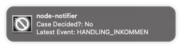

## Introduction
This small app helps you fetch the status of your Migrationsverket application periodically and notify you using your local computer notification system.

## How to run:
1. Login into Migrationsverket website.
2. Use DevTools Network tab to get:

    a. Direct url for your application.
    
    b. Cookie.
    
    c. XSRF Token.

3. Add these values to the config file & rename the file to `conf.json`.
4. run `npm install`.
5. run `npm start`.
6. Allow notification if a permission request pops up.

## Example Result
If everything is set right, you should see a notification like this:

